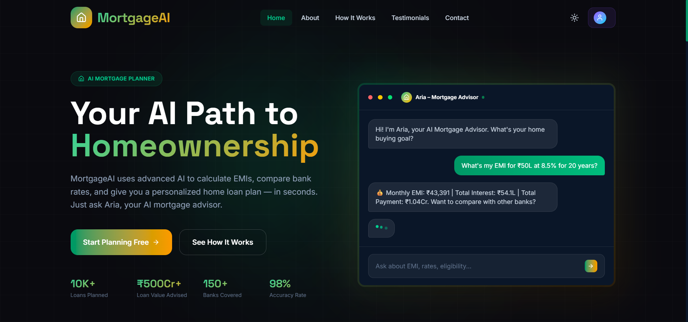
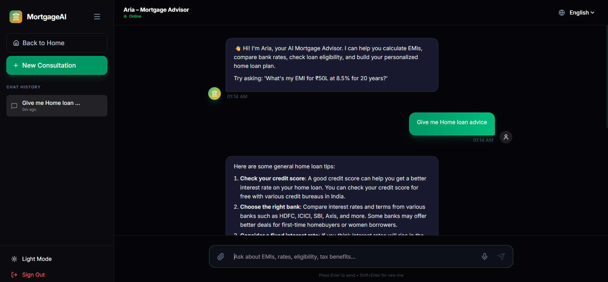
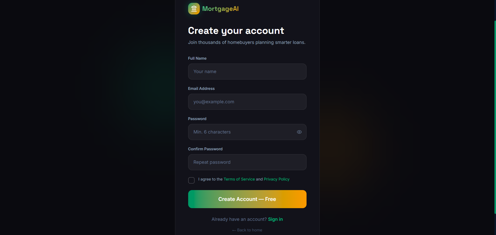

# 🏠 MortgageAI: Your AI-Powered Home Journey

[](https://reactjs.org/)
[](https://nodejs.org/)
[](https://www.mongodb.com/)
[](https://tailwindcss.com/)
[](https://vitejs.dev/)

**MortgageAI** is a premium full-stack MERN application designed to simplify the complex world of home loans for Indian homebuyers. Leveraging advanced AI logic and a sleek, emerald-themed interface, MortgageAI provides personalized financial advice, real-time EMI calculations, and bank rate comparisons to help you secure your future home.

---

## 🖼️ Feature Showcases

| Home Page | AI Chat Interface | Authentication |
| :---: | :---: | :---: |
|  |  |  |

---

## 🚀 Key Features

- **🤖 Aria AI Advisor**: A specialized conversational agent that helps you calculate eligibility, compare lenders, and understand tax benefits (80C, 24b) through natural conversation.
- **📊 Real-time EMI Engine**: Instant, accurate calculations for monthly payments, total interest, and complete repayment schedules.
- **🏦 Multi-Bank Comparison**: Compare interest rates across 150+ Indian banks and NBFCs to find the most cost-effective loan.
- **🔐 Privacy & Security**:
  - Financial data is encrypted at rest using **AES-256-GCM**.
  - Secure JWT-based authentication with protected user sessions.
- **🎨 Premium UI/UX**:
  - Professional emerald-and-amber aesthetic with **Glassmorphism**.
  - High-performance micro-animations powered by **Framer Motion**.
  - Responsive layout with a professional sidebar and intuitive navigation.
- **🌗 Smart Theme Mode**: Native support for high-contrast dark mode and clean light mode.

---

## 🛠️ Technology Stack

### **Frontend**
- **React (Vite)**: Modern, high-performance SPA framework.
- **Tailwind CSS v4**: Advanced utility-first styling for a professional financial look.
- **Framer Motion**: Smooth interactive animations.
- **React Markdown**: Clean rendering of complex AI financial plans.
- **Lucide React**: Premium financial and navigation iconography.

### **Backend**
- **Node.js & Express**: Scalable server-side infrastructure.
- **Groq SDK (Llama 3.1)**: Blazing-fast AI inference for financial advisory.
- **MongoDB & Mongoose**: Secure data persistence for user profiles and chat history.
- **JSON Web Token (JWT)**: Secure, stateless session management.
- **BcryptJS**: Industry-standard password encryption.

---

## 📂 Project Structure

```bash
MortgageAI/
├── client/              # Vite + React Frontend
│   ├── src/
│   │   ├── components/  # Navbar, Footer, Chat UI, etc.
│   │   ├── pages/       # Home, Chat, Blog, Careers, Legal, etc.
│   │   ├── hooks/       # Auth and Theme logic
│   │   └── index.css    # Global emerald/amber theme system
│   └── public/          # Feature images and brand assets
└── server/              # Node.js + Express Backend
    ├── config/          # Database and AI configurations
    ├── controllers/     # Mortgage logic and AI handling
    ├── models/          # User, Chat, and Mortgage Plan schemas
    ├── routes/          # API endpoint definitions
    └── index.js         # Server entry point
```

---

## ⚙️ Setup & Installation

### **Prerequisites**
- **Node.js** (v18 or higher)
- **MongoDB** (Local or Atlas instance)
- **Groq API Key** (for AI Advisory)

### **1. Clone & Install**
```bash
git clone <your-repo-url>
cd MortgageAI

# Install Backend Dependencies
cd server
npm install

# Install Frontend Dependencies
cd ../client
npm install
```

### **2. Environment Configuration**
Create a `.env` file in the `server` directory:
```env
PORT=5000
MONGODB_URI=your_mongodb_connection_string
JWT_SECRET=your_super_secret_key
GROQ_API_KEY=your_groq_api_key
NODE_ENV=development
```

### **3. Run the Application**

**Start Backend:**
```bash
cd server
npm run dev
```

**Start Frontend:**
```bash
cd client
npm run dev
```

The application will be available at `http://localhost:5173`.

---

## 🔗 API Endpoints (Quick Reference)

| Method | Endpoint | Description |
| :--- | :--- | :--- |
| `POST` | `/api/auth/signup` | User Registration |
| `POST` | `/api/auth/login` | User Authentication |
| `POST` | `/api/chat/send` | Chat with Aria AI Advisor |
| `GET` | `/api/chat/history` | Fetch personalized chat history |
| `POST` | `/api/contact/submit` | Submit support inquiries |

---

## 🤝 Contributing

We welcome contributions to help make homeownership accessible to everyone. 

1. Fork the Project
2. Create your Feature Branch (`git checkout -b feature/AmazingFeature`)
3. Commit your Changes (`git commit -m 'Add some AmazingFeature'`)
4. Push to the Branch (`git push origin feature/AmazingFeature`)
5. Open a Pull Request

---

## 📄 License

Distributed under the MIT License. See `LICENSE` for more information.

---

<p align="center">
  Developed with ❤️ for the Future Homeowners.
</p>
